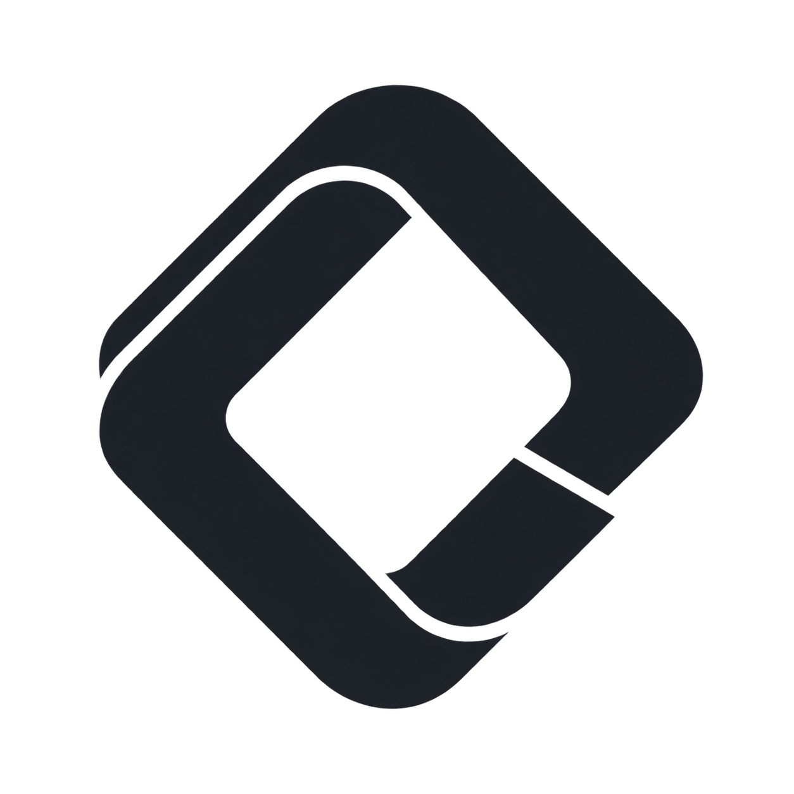
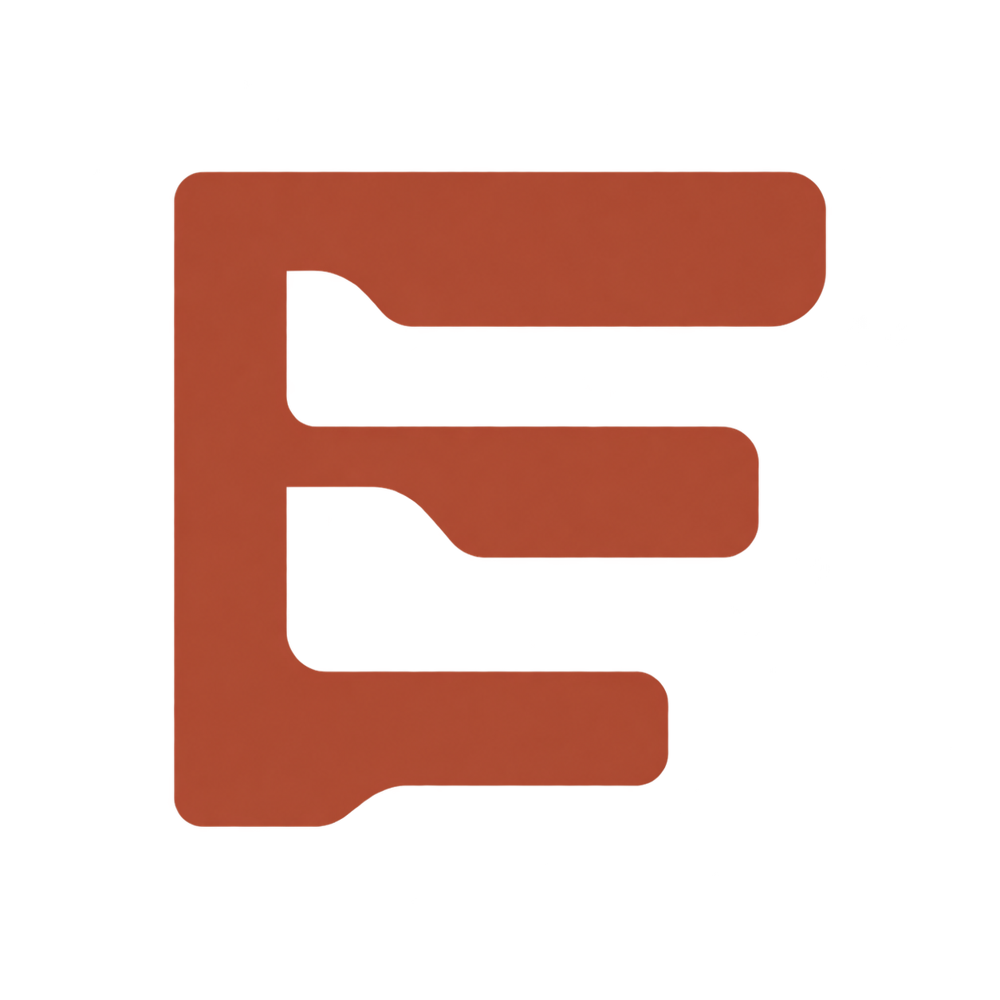

# Spiral

Spiral 帮助 Codex 在一次次任务中，既能把工作可靠地完成，也能逐渐理解项目本身。

它由两个独立、可组合的插件构成：

-  **Loop** 负责交付。用户只需描述想要的结果；Loop 会理解意图、补齐常规细节、推进执行，并用适合该任务的证据验证成果。
-  **Ethos** 负责积累项目判断。它把已经确认的意图、领域语义、架构取舍、协作方式和工程实践整理为可复用的项目知识，让后续工作更符合这个项目的实际需要。

## 为什么需要两个插件

完成一个任务和记住一次任务中真正学到的东西，是两种不同的能力。

Loop 关注当前目标能否端到端地完成：例如实现功能、修复问题、完成调研、撰写文档，或制作其他交付物。它不要求用户把分析、拆分、测试、审查与修复逐项写进提示词。

并行分工时，Loop 按子任务的复杂度和风险选择模型：简单任务使用轻量模型，常规实现使用均衡模型，复杂分析与高风险工作使用高级模型；执行中发现难度超出预期时重新评估并升级。具体模型取决于当前环境支持的能力，无法切换时会明确记录回退情况。

Ethos 关注哪些经验值得成为长期依据：例如一个已经确认的产品原则、领域规则，或架构选择的适用条件。它避免把每次对话都变成记录，同时让有价值的判断不会只留在一次会话里。

## 如何配合

两个插件都可以单独使用。

当两者同时可用时，Loop 完成任务后可以把已验证、且对未来仍有意义的经验交给 Ethos 整理。Ethos 不会阻碍交付；没有 Ethos 时，Loop 仍然独立完成并验证工作。

```text
想完成一件事：$loop 为登录页增加“记住我”
想沉淀判断：$ethos 把这次架构取舍沉淀成项目今后的判断规则
```
